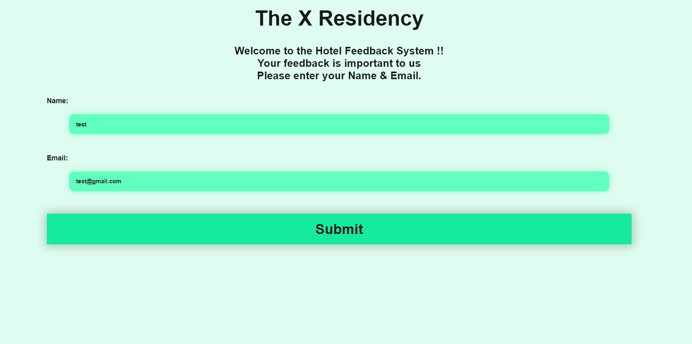
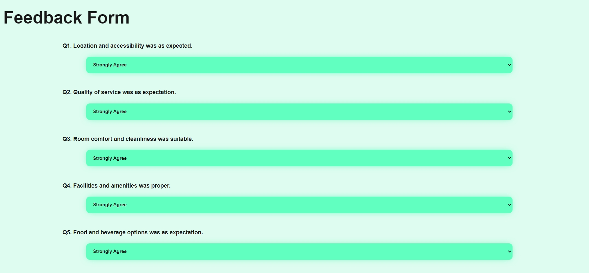
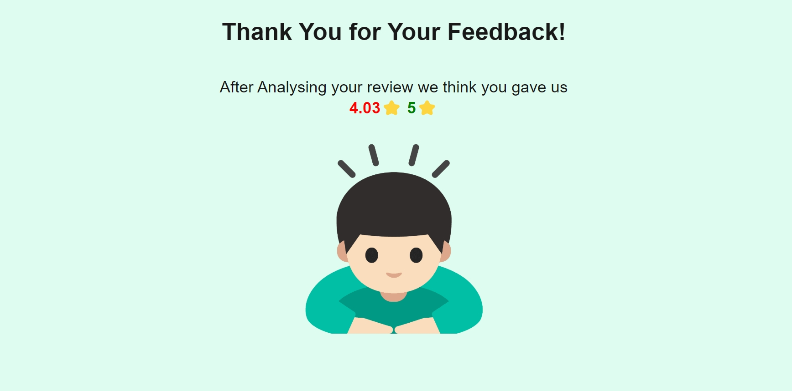

# RATE MY HOTEL

A hotel review system that harnesses the power of machine learning to generate authentic ratings and detailed reviews based on your sentiment analysis. 
Rate My Hotel is a web app created with Flask that integrates easily with an existing hotel review system and provides a quick and easy way of gathering and analysing customer feedback.


## 🚀 Machine Learning 🚀

The application boosts its performance using machine learning models trained on a huge dataset, designed specifically for analysing hotel reviews with an accuracy of **99% !!**

The model itself is trained on authentic user reviews collected physically from each cusotmer to create a model capable of predicting rating of real world.
> ### **Models Used : [Hotel Review Sentiment Analysis](https://github.com/Krishna-Noutiyal/Hotel-Review-Sentiment-Analysis.git)**

---

Home Page
--

Users will be welcomed with an AI voice asking them to give valuable feedback with relative customer information.



Feedback Page
--

A modern feedback page with questions designed to get reviews of hotel in every aspect;



Thank You 😄
--
We should thank our user good enough, that they never forget US !!



---

## ✨ Features
- **Trained Models**: Predict hotel ratings using highly accurate ML models.
- **Speech Synthesis**: Text to Speech synthesis to greet customers.
- **Multiple Models**: Choose between ML models to your preference.
- **User-Friendly**: With modern and easy on eye look that attracts customers.
- **Security Focus**: Designed with cyber security in mind to minimize any security risk.
- **Database Intigration**: A minimal implementation of database using csv.

---

## 🛠️ Technologies Used
- **Python**: Core programming language.
- **Scikit-Learn**: For machine learning model development.
- **Flask**: For creating the web application
- **Pandas & NumPy**: For data handling and processing.

---


## 🚀 Getting Started

### Prerequisites
- Python 3.11+
- Libraries: Install dependencies from `requirements.txt`:
  ```bash
  pip install -r requirements.txt
  ```

### ⚙️ Running the Project
Start the application using:
```bash
py app.py
```
The application will start hosting on a temprorary server on `localhost` port `5000`,
Open browser and past this url:
```bash
http://localhost:5000/
```

---

## 📈 Future Enhancements
- Improve the UI of the application
- Code reduction ( app uses a lot of code from the [HRSA](https://github.com/Krishna-Noutiyal/Hotel-Review-Sentiment-Analysis.git) repository that can be removed )
- Natural Voice using new technologies 

---

## 🤝 Contributing
Feel free to submit issues or pull requests! Contributions are welcome to improve the repository further.

---
